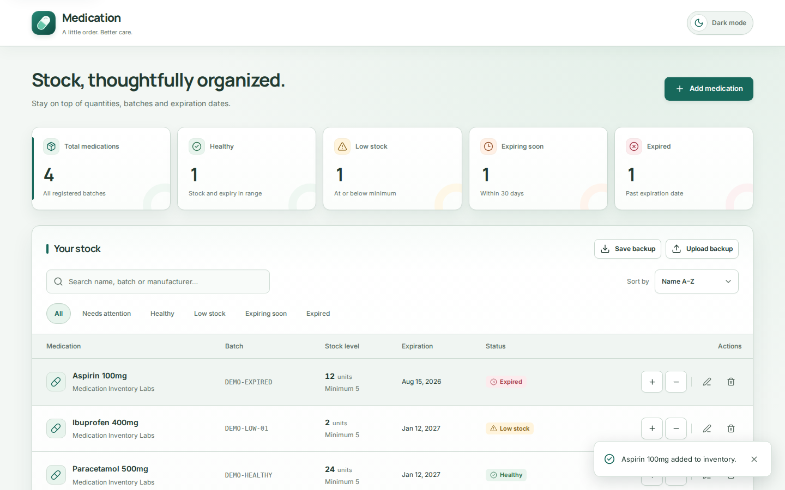
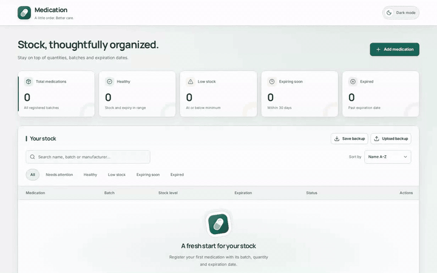

<p align="center">
  
</p>

<h1 align="center">Medication Inventory</h1>

<p align="center">
  A focused, responsive web workspace for medication stock tracking, batch numbers, expiration monitoring, and unit movements.
</p>

<p align="center">
  <a href="https://inventory.leonemarcos.com/">
    
  </a>
  <a href="https://github.com/LeoneMarcos/medication-inventory/actions/workflows/ci.yml">
    
  </a>
  <a href="LICENSE">
    
  </a>
</p>

<p align="center">
  
  
  
  
  
</p>

<p align="center">
  <a href="#overview">Overview</a> ·
  <a href="#showcase">Showcase</a> ·
  <a href="#features">Features</a> ·
  <a href="#architecture">Architecture</a> ·
  <a href="#storage-and-limits">Storage & Limits</a> ·
  <a href="#tech-stack">Tech Stack</a> ·
  <a href="#quick-start">Quick Start</a>
</p>

---

## Overview

**Medication Inventory** is a client-side pharmaceutical and clinical stock management application designed with a clean teal-green identity, light/dark theme adaptation, and responsive desktop/mobile layouts.

It gives clinic staff, pharmacy supervisors, and small healthcare teams instant visibility into stock levels, batch numbers, manufacturers, and expiration schedules without requiring complex server infrastructure or third-party accounts.

<p align="center">
  
</p>

---

## Showcase

Watch the short product walk-through demonstrating initial stock review, adding records, search, status filtering, stock adjustments, and theme switching:

[](https://raw.githubusercontent.com/LeoneMarcos/medication-inventory/main/showcase-assets/medication-inventory-showcase.mp4)

The animated preview shows a short excerpt of the canonical showcase. Open the full video below for the complete flow.

[](https://raw.githubusercontent.com/LeoneMarcos/medication-inventory/main/showcase-assets/medication-inventory-showcase.mp4)

---

## Features

- **Inventory overview** — Real-time classification into Healthy, Low Stock, Expiring Soon (30-day window), and Expired.
- **Interactive dashboard** — Click any metric card to filter the inventory list to matching batches.
- **Status filters** — Narrow the inventory to needs attention, healthy, low stock, expiring soon, or expired records without duplicating the dashboard summary.
- **Batches & expiration control** — Strict date validation preventing invalid calendar dates and retaining proper records.
- **Safe stock adjustments** — Add or remove units with a live post-adjustment balance preview and bounds checks preventing negative stock.
- **Data portability** — Download versioned JSON backups and restore validated backups only after explicit confirmation.
- **Faceted search & sorting** — Search by medication name, active ingredient, batch number, or manufacturer, with sorting by Name, Expiration, or Quantity.
- **Light & dark themes** — Built-in theme switcher with flash-free initial hydration and system color scheme detection.
- **Accessible & compliant** — Full keyboard trap in modals, ARIA labels, live status regions, and `prefers-reduced-motion` respect.

---

## Architecture

The codebase follows a straightforward, low-friction architecture without unnecessary abstraction layers:

```
src/
├── components/
│   ├── domain/           # Core domain UI (DashboardStats, InventoryTable, MedicationForm)
│   └── ui/               # Reusable primitives (Button, Card, Input, Modal)
├── hooks/
│   ├── useInventory.ts   # Inventory state management and safe persistence boundary
│   └── useTheme.ts       # Light/Dark mode state and DOM synchronization
├── lib/
│   ├── dataPortability.ts # Versioned JSON backup/restore validation and CSV serialization
│   ├── inventory.ts      # Filtering and search predicates
│   ├── medications.ts    # Domain logic (status calculation, stock math, date parsers)
│   ├── metrics.ts        # Dashboard statistics calculation
│   ├── storage.ts        # Malformed record sanitization and localStorage I/O
│   └── utils.ts          # Style merging utility (clsx + tailwind-merge)
└── types/
    └── index.ts          # Core TypeScript types (Medication, MedicationStatus, etc.)
```

---

## Storage and Limits

- **Storage mechanism:** Persistent local storage under key `medication-inventory-data`.
- **Sanitization:** `parseStoredMedications` verifies every field on startup, rejecting corrupted records, invalid types, and impossible calendar dates.
- **Backup validation:** JSON restore is versioned and atomic; the full backup is rejected when a record is invalid, medication IDs are duplicated, or stock values exceed the supported safe-integer boundary.
- **Atomic persistence & Error handling:** State mutations are atomic—in-memory inventory is only committed if localStorage persistence succeeds. If browser storage fails (e.g. `QuotaExceededError` or private browsing restrictions), operations display proportional alert notices, preserve open dialogs and entered data for retry, and never falsely claim changes were saved.
- **Representation limit:** Stock adjustments enforce JavaScript's safe integer boundary (`Number.MAX_SAFE_INTEGER`, 9,007,199,254,740,991 units) to prevent numeric overflow while strictly preserving user data.

---

## Tech Stack

| Area     | Technologies                                     |
| -------- | ------------------------------------------------ |
| Frontend | React 19, TypeScript 5.9                         |
| Styling  | Tailwind CSS 4.3, Custom CSS Tokens (Teal theme) |
| Icons    | Lucide React                                     |
| Tooling  | Vite 7                                           |
| Testing  | Vitest 4, Playwright                             |
| Linting  | ESLint 10                                        |
| CI       | GitHub Actions                                   |

---

## Quick Start

### Prerequisites

- Node.js 22 (recommended for Vite 7) and npm (use `npm ci` to respect `package-lock.json`)
- Optional for showcase capture and QA: Chrome/Playwright, FFmpeg, and an active local preview/dev server

### 1. Clone the repository

```bash
git clone https://github.com/LeoneMarcos/medication-inventory.git
cd medication-inventory
```

### 2. Install dependencies

```bash
npm ci
```

### 3. Run locally

```bash
npm run dev
```

Open the local server URL printed by Vite (typically `http://localhost:5173`).

---

## Testing & Quality Assurance

Run the automated test suite, type-checking, and lint checks:

```bash
# Run unit and boundary tests
npm test

# Check types
npm run typecheck

# Run ESLint
npm run lint

# Check formatting
npm run format:check

# Install the Chromium browser required by Playwright (once per environment)
npx playwright install chromium

# Run Playwright end-to-end tests
npm run test:e2e

# Build production bundle
npm run build
```

The automated CI pipeline enforces quality checks on Node.js 22.x, covering security audits, formatting, linting, TypeScript compilation (`tsc -b`), Vitest unit tests, production build validation, and Playwright Chromium E2E testing. The **Publish Showcase** GitHub Actions workflow regenerates the canonical video, hero screenshot, and short README GIF preview when product/showcase inputs change, and can also be run manually; those stable media paths are reused by the project README, profile, and portfolio.

### Negative QA Scripts

- `node scripts/negative-storage-qa.mjs` — Automated verification of storage failure modals and retry flow. Requires an active local application server (default `http://127.0.0.1:4181/` or configured via `BASE_URL`).

---

## Documentation

- [`DESIGN.md`](DESIGN.md) — Visual tokens, layout specifications, and interaction states.
- [`STACK.md`](STACK.md) — Technology stack constraints and rules.
- [`docs/STATUS.md`](docs/STATUS.md) — Status log and release evidence.

---

## License

Licensed under the **Apache License 2.0**. See [`LICENSE`](LICENSE) for details.
